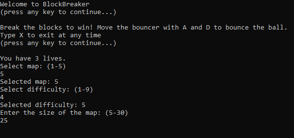
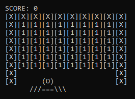
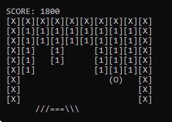
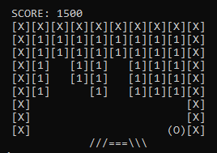
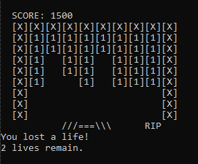
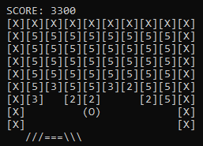
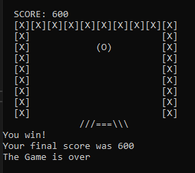

# Block Breaker Game
A simple game that runs in the console.

You can choose one of 5 dynamically created maps, as well as
customize the difficulty of the game and the size of the board.

At start, and every time you die, you can move the Bouncer left/right to select a spot to
launch the ball upwards.

The ball will stay in motion, bouncing off blocks and walls, breaking blocks it comes into contact with.
Move the Bouncer to catch it.

 
If you fail to catch the ball, you will lose a life.

At higher difficulties, blocks will require multiple bounces to break.

Break all the blocks to win. More blocks broken means a higher score.
